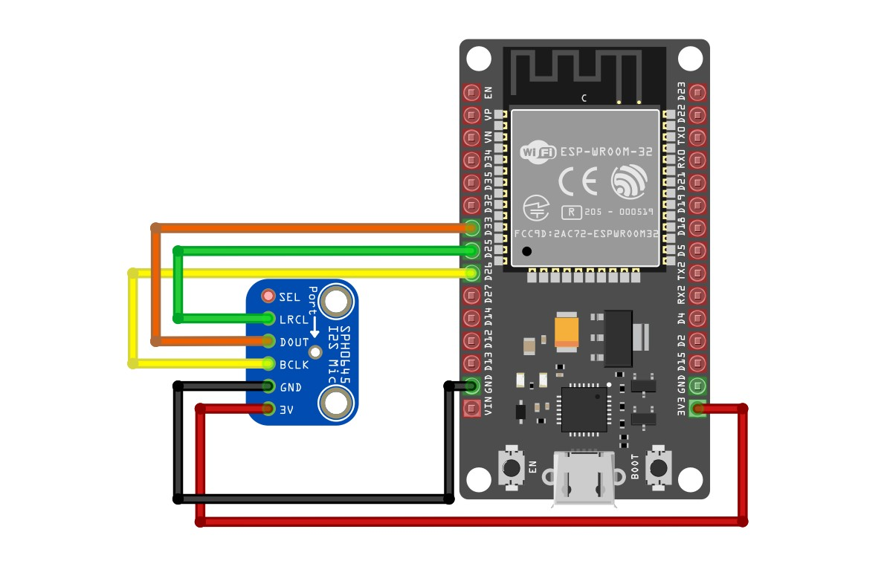
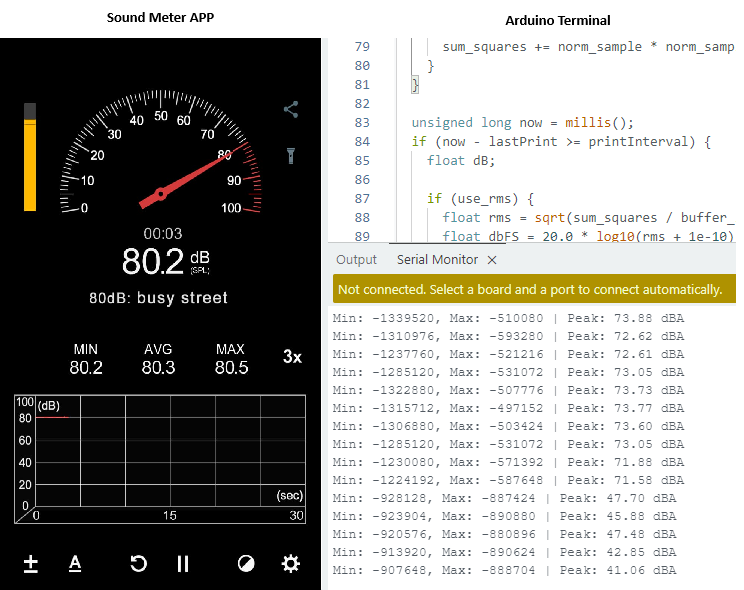

# I2S SPH0645 Microphone with ESP32

This repository provides example projects for reading audio data from the SPH0645 MEMS I2S microphone using an ESP32. It includes:

- **dBA Meter** implementation with calibration support.
- **Raw signal test** for min/max sample logging.
- A circuit wiring diagram to guide physical setup.

---

## Folder Structure

### `I2S_Sound_dBA_SPH0645/`
An example to calculate approximate sound pressure levels (dBA) using either:
- Peak-to-peak amplitude, or
- RMS (Root Mean Square)

**Features:**
- Adjustable gain and dBA offset for calibration
- RMS or Peak mode toggle
- 44.1 kHz sampling rate

### `I2S_Sound_ESP32_SPH0645_Test/`
A minimal sketch to read and log the min/max values of the I2S signal. Useful for debugging sensor wiring and signal shape.

### `Circuit_Diagram/`
Contains an image of how to wire the **SPH0645 I2S microphone** to an **ESP32** board.

---

## Wiring (ESP32 ↔ SPH0645)

| SPH0645 Pin | ESP32 Pin |
|-------------|-----------|
| VCC         | 3.3V      |
| GND         | GND       |
| WS (LRCLK)  | GPIO 25   |
| BCLK        | GPIO 26   |
| DOUT        | GPIO 33   |
| SEL         | Not Used  |

> Note: The sensor manufacturer mention that the SEL pin determines the audio channel — connecting it to GND selects the left channel, while connecting it to 3.3V selects the right channel. In these examples, the SEL pin was left unconnected, and the microphone defaulted to the left channel and worked without issue. If you see continuous zeros (0...0...0) in the Serial Monitor, try switching the channel in the code (I2S_CHANNEL_FMT_ONLY_LEFT ↔ I2S_CHANNEL_FMT_ONLY_RIGHT), or explicitly connect the SEL pin to GND or 3.3V to force the desired output.

---

## Boards Tested On

The code was tested and works (with no variation) on:

- **ESP32 DevKit v1**
- **ESP32-WROOM-32E**
- **Freenove ESP32-WROOM Board** 

The microphone output is uncalibrated, but reported dBA values closely match readings from Android app "Sound Meter". I have yet to do the calibration with better and actual sound meter if I did you guys would see an update here!!

---

## Calibration Tips

To better align the microphone's output with real-world dBA levels:

- Adjust the `dbA_offset` value to match readings from a reference sound level meter or app.
- Use `gain_adjustment` to manually scale the amplitude if the signal appears too weak or strong.
- Toggle `use_rms` to switch between **RMS-based SPL** and **Peak-to-Peak amplitude** calculation. RMS may provide a more consistent reading for continuous sounds.

### Example Observations

- In a quiet room with minimal ambient noise, the reported sound level was approximately **40 dBA**.
- When playing a **1000 Hz sine wave** at full volume from [onlinetonegenerator.com](https://onlinetonegenerator.com/), the reported values were around **72–74 dBA**.

> These values are approximate and not from a calibrated reference instrument, but they demonstrate relative sensitivity and responsiveness of the sensor setup.
---

## License

This project is licensed under the **MIT License** — you are free to use, modify, and distribute it with proper attribution.  
See the [LICENSE](LICENSE) file for details.

---

## Contributions

Contributions are welcome!  
Feel free to **fork** the repository, **open issues**, or submit **pull requests** to improve this library.

---

## Sources / References

These resources were helpful during development and testing:

- [DIYI0T: I2S Sound Tutorial for ESP32](https://diyi0t.com/i2s-sound-tutorial-for-esp32/)
- [ESP32 Forum Thread: I2S Mic on ESP32](https://esp32.com/viewtopic.php?t=20835)
- [atomic14’s ESP32 I2S Mic Test (GitHub)](https://github.com/atomic14/esp32-i2s-mic-test)
